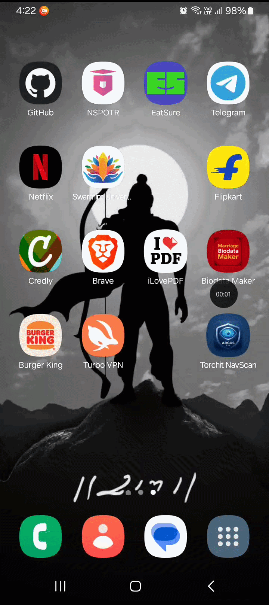

# Torchit NavScan (BLE Prototype)

An Android BLE scanning app that discovers and lists nearby assistive hardware (e.g. Torchit's Saarthi Smart Cane) in real time — built as a hardware diagnostic companion tool.

## Features

* Live BLE device discovery via `BluetoothLeScanner`, with a 10-second scan timeout (`Handler`) so scans don't run indefinitely.
* Android 12+ runtime permission handling for `BLUETOOTH_SCAN` / `BLUETOOTH_CONNECT`, plus location permissions required on older Android versions.
* Checks that Bluetooth is actually enabled before scanning, with a Toast prompt if it isn't.
* `contentDescription` on every interactive view for TalkBack screen-reader support.
* Simulated fallback entry (`Saarthi Smart Cane (Simulated)`) so the UI is testable without real hardware nearby.

## Requirements

* Java, Android Studio
* minSdk 31 (Android 12) — required by the BLE permission APIs used here
* A physical device (BLE scanning doesn't work on the emulator)

## Tech Stack

* Java, `BluetoothLeScanner` / `ScanCallback` (Android BLE APIs)
* `ArrayAdapter` + `ListView` for the live-updating device list
